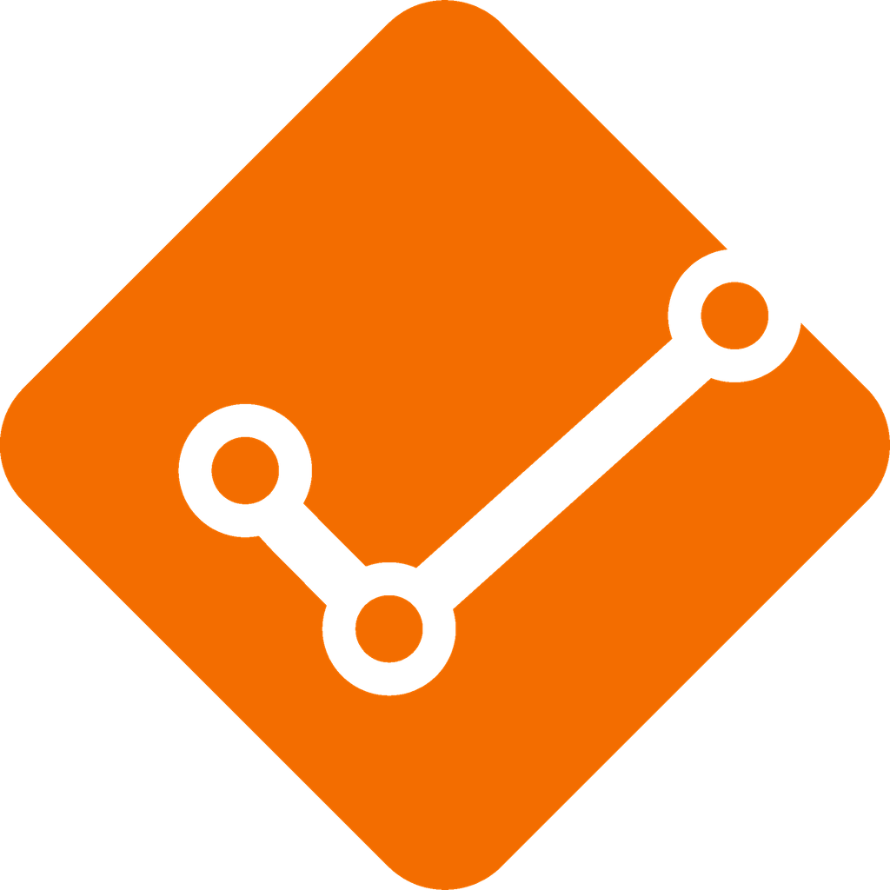

<p align=center>

</p>

# PR Assigner
A Swift AWS Lambda to automatically assign engineers to pull requests with a Slack integration.

|         | Features           |
| ------------- |:-------------|
| 🙅 | Never drop a Slack message with `@here` to ask for a review again |
| 🚀 | Runs using [Swift AWS Lambda](https://github.com/swift-server/swift-aws-lambda-runtime) (no CI involved) |
| 👤 | Selects *n* engineers randomly to assign to the PR |
| 🤙🏻 | Skips engineers with a custom status on Slack (ex. `🤒 sick`, `🌴 on holiday` , `📚 training day`) |
| 💬 | Posts a message on a Slack room tagging assigned engineers |
| 🔒 | CODEOWNERS is fully supported and they will be tagged on Slack |
| ➕ | You can still manually assign PRs and PR Assigner will just add who is missing to the party |

## Requirements
* Install [Docker](https://docs.docker.com/get-docker/)
* Xcode 12.3+
* Swift 5.3+

## Getting started
To setup PR Assigner in your repo, you need:
* **A list of engineers** that can't wait to review PRs!
* **A GitHub repo** where you have admin permissions (you'll need to setup a hook).
* **An AWS environment** where you'll deploy PR Assigner as a lambda.
* **A Slack app** approved in your workspace with `chat:write` and `users:read` scopes.
* **A Slack channel** where your Slack app and engineers are part of.

For more info on how to setup PR Assigner in your repos, you can head over to our [documentation](./docs/Documentation.md).

## Installation
```sh
$ git clone https://github.com/justeat/PRAssigner.git
$ cd PRAssigner/
```

- Store your AWS credentials in a `.credz` file

```
export AWS_SECRET_ACCESS_KEY=<value>
export AWS_ACCESS_KEY_ID=<value>
export AWS_DEFAULT_REGION=<value>
```

- Create a `.secrets.yml` file based on the `.secrets_template.yml` file and customize accordingly

```sh
$ cp .secrets_template.yml .secrets.yml
$ nano .secrets.yml
```

- Deploy PR Assigner

```sh
$ ./PRAssigner.sh ship
```

## Usage
You can customize how PR Assigner works by adding a `.pr-assigner.yml` file in the root of your repo.

```yml
# List of GitHub pull request event actions to continue the execution of PR Assigner.
# Full list here: https://docs.github.com/en/developers/webhooks-and-events/github-event-types#pullrequestevent
pr_actions:
  - "opened"
  - "reopened"
  - "review_requested"

# Number of reviewers to assign to the PR on GitHub.
number_of_reviewers: 2

# List of Slack status that let discard the selected reviewer.
# They are all emoji in the Slack format.
discardable_slack_status:
  - ":face_with_thermometer:"
  - ":palm_tree:"
  - ":books:"

# If true, reviewers won't get assigned to draft PRs.
skip_draft: false

# Slack channel in which will be posted messages tagging selected reviewers.
# Make sure both your Slack app and all your candidates reviewers are invited in this channel.
#
# It can be both the channel name (ex. #ios-pull-requests) or the Slack ID.
# The channel can be public or private.
slack_pr_channel: "#ios-pull-requests"

# List of candidates to be assigned to a PR.
# The value needs to contain the GitHub username and the Slack ID separate by ":" (ex. "andreaantonioni:ABCD1234").
reviewers:
  - "andreaantonioni:ABCD1234"
```

## Licence
PR Assigner is available under the Apache License Version 2.0, January 2004. See the LICENSE file for more info.

* Just Eat iOS team
