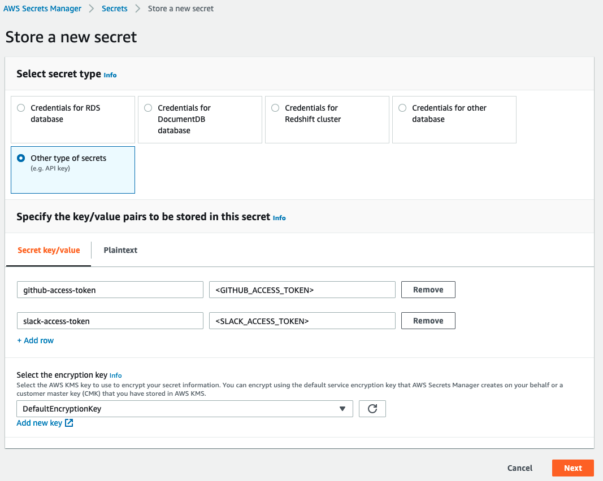

# Documentation

This is a list of steps to follow in order to start using PR Assigner in your repos:

### 1. Install all tools

Before moving on, make sure you have installed in your local machine the tools listed in the Requirements section.

### 2. Create an AWS user

Create an AWS user with the following permissions:

- `IAMFullAccess`
- `AmazonS3FullAccess`
- `AmazonEC2ReadOnlyAccess`
- `CloudWatchLogsFullAccess`
- `AmazonAPIGatewayAdministrator`
- `AWSCloudFormationFullAccess`
- `AWSLambda_FullAccess`

and store its credentials in a `.credz` file respecting the following format:

```
export AWS_SECRET_ACCESS_KEY=<value>
export AWS_ACCESS_KEY_ID=<value>
export AWS_DEFAULT_REGION=<value>
```

This file is in `.gitignore` to avoid being pushed remotely.

### 3. Create a Slack app

PR Assigner needs an approved Slack app in your workspace, this will allow the tool to check Slack users' status and to post messages on a channel. The Slack app requires these scopes: `chat:write` and `users:read`.

You can follow this guide on [How to create a Slack app](https://api.slack.com/authentication/basics).

### 4. Get a GitHub access token

PR Assigner also needs a GitHub access token in order to assign PR to GitHub users. If you already have a GitHub account you use for bots we recommend to use it instead of creating an access token from a developer account.

Remember that this access token needs to have write permissions on repos you will decide to setup PR Assigner.

You can follow this guide on [How to create a GitHub access token](https://docs.github.com/en/github/authenticating-to-github/creating-a-personal-access-token).

### 5. Add access tokens to AWS Secrets Manager

GitHub and Slack access tokens are sensible information that should be commited on git. To allow PR Assigner to have access to them in a secure way, we use the AWS service called [Secrets Manager](https://docs.aws.amazon.com/secretsmanager/latest/userguide/intro.html).

You can follow this guide on How to create a secret in [AWS Secrets Manager.](https://docs.aws.amazon.com/secretsmanager/latest/userguide/manage_create-basic-secret.html)

The secrets key need to be:
* `github-access-token` for the GitHub access token
* `slack-access-token` for the Slack access token



### 6. Create `.secrets.yml`

To deploy PR Assigner as a Lambda we use [Serverless Framework](https://www.serverless.com/framework/docs/getting-started/). This tools allows to have a written configuration of the AWS configurations and services the lambda will need in order to operate correctly.
Create a file named `.secrets.yml` in the root folder. This file contains sensible information about your AWS account, reason why it's in `.gitignore` to avoid being pushed remotely.

```yml
environment:
  GITHUB_API_URL: # GitHub API URL used by the lambda to use GitHub APIs
  SECRETS_NAME: # Name of the secrets you stored in AWS Secrets Manager
  REGION: # AWS Region where the secrets are stored

region: # AWS region used to deploy your lambda

account_id: # AWS account id

vpc: # VPC configuration for the lambda

resourcePolicy: # Resource policy applied to the lambda
```

After you created this file, you can deploy PR Assigner in your AWS environment with the following command:

```sh
$ ./PRAssigner.sh ship
```

### 7. Add a webhook on GitHub repos

At the end of the previous step, Serverless should have printed in your console something like this:

```sh
Service Information
service: PRAssigner
stage: dev
region: # you AWS region
stack: PRAssigner-dev
resources: 10
api keys:
  None
endpoints:
  POST - https://{random_characters}.execute-api.{aws_region}.amazonaws.com/dev/github-event
functions:
  handler: PRAssigner-dev-handler
layers:
  None
```

Now you need to setup a webhook for each repo you intend to use PR Assigner using the POST endpoint printed in the console. This will trigger PR Assigner each time the repo will fire an event.

You can follow this guide on [How to setup a webhook on a GitHub repo.](https://docs.github.com/en/developers/webhooks-and-events/creating-webhooks#setting-up-a-webhook)

The config is:
* Payload URL: use the POST endpoint printed in the console.
* Content type: `application/json`.
* Select individual events: Pull requests.

### 8. Add `.pr-assigner.yml` to your repos

Add the file `.pr-assigner.yml` to the root of each repo you intend to use PR Assigner. Feel free to customize each variable to meet you team needs:
```yml
# List of GitHub pull request event actions to continue the execution of PR Assigner.
# Full list here: https://docs.github.com/en/developers/webhooks-and-events/github-event-types#pullrequestevent
pr_actions:
  - "opened"
  - "reopened"
  - "review_requested"

# Number of reviewers to assign to the PR on GitHub.
number_of_reviewers: 2

# List of Slack status that let discard the selected reviewer.
# They are all emoji in the Slack format.
discardable_slack_status:
  - ":face_with_thermometer:"
  - ":palm_tree:"
  - ":books:"

# If true, reviewers won't get assigned to draft PRs.
skip_draft: false

# Slack channel in which will be posted messages tagging selected reviewers.
# Make sure both your Slack app and all your candidates reviewers are invited in this channel.
#
# It can be both the channel name (ex. #ios-prs) or the Slack ID.
# The channel can be public or private.
slack_pr_channel: "#ios-pull-requests"

# List of candidates to be assigned to a PR.
# The value needs to contain the GitHub username and the Slack ID separate by ":" (ex. "andreaantonioni:ABCD1234").
reviewers:
  - "andreaantonioni:ABCD1234"
```

### 9. Uninstall PR Assigner

Should you want to remove PR Assigner and destroy the associated infrastructure, run the following command:

```sh
$ ./PRAssigner.sh destroy
```
